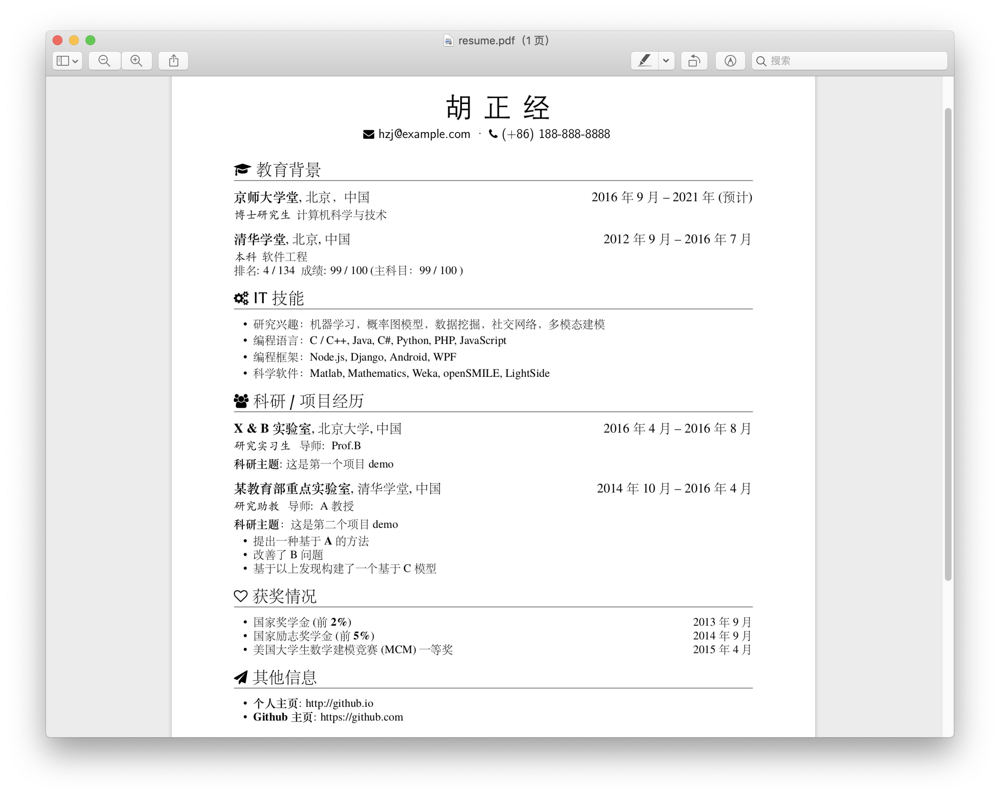

# 个人简历 Résumé

本项目为个人简历 Latex 源码存放，原项目 [resume](https://github.com/billryan/resume/)

An elegant \LaTeX\ résumé template, compiled with \XeLaTeX. Inspired by 

- [zachscrivena/simple-resume-cv](https://github.com/zachscrivena/simple-resume-cv)
- [res](https://www.ctan.org/pkg/res)
- [JianXu's CV](http://www.jianxu.net/en/files/JianXu_CV.pdf)
- [paciorek's CV/Resume template](http://www.stat.berkeley.edu/~paciorek/computingTips/Latex_template_creating_CV_.html)
- [How to write a LaTeX class file and design your own CV (Part 1) - ShareLaTeX](https://www.sharelatex.com/blog/2011/03/27/how-to-write-a-latex-class-file-and-design-your-own-cv.html)

## 特性

- 完善的 Unicode 字体支持, 使用 \XeLaTeX\ 编译
- 支持 FontAwesome 4.3.0 

### 效果预览

## 使用方法

1. ShareLaTeX 在线编译（需将源码以 zip 格式打包上传至 ShareLatex 进行在线编译与预览
2. 使用较新的 \LaTeX\ 发行版在本地计算机编译

### 宏

- `\name`: 姓名
- `\contactInfo`: 联系信息, 需要三项信息，分别是{邮箱}{手机号}{个人主页}，如需增加/修改，需要修改 cls 文件
- `\section`: 用于分节, 如教育背景, 实习/项目经历等
- `\subsection`: 用于小节标题, 无日期选项
- `\datedsubsection`: 用于小节标题, 简历中使用最广，第二项为时间区间，自动右对齐
- `\itemize`: 清单列表，简历中应用最广
- `\enumerate`: 枚举列表，数字标号

### FontAwesome

首先在 [Font Awesome Icons](http://fortawesome.github.io/Font-Awesome/icons/) 上选中自己想使用的图标，然后在 [fontawesome.sty](https://github.com/billryan/resume/blob/zh_CN/fontawesome.sty) 中找到相应的宏,将其作为普通文本一样使用。

其他的可以自行参考相应 cls 和 tex 文件。

## License

[The MIT License (MIT)](http://opensource.org/licenses/MIT)

Copyrighted fonts are not subjected to this License.

